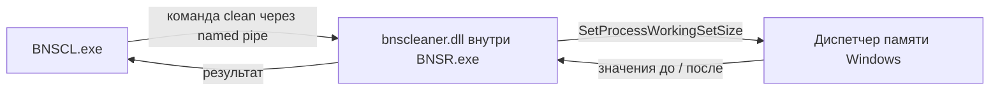

# BNSCL

[](https://github.com/Univashka/BNSCL/releases)

[English version](README.md)

BNSCL — компактная утилита для очистки рабочего набора **Blade & Soul NEO** в Windows. Она состоит из небольшого WPF-интерфейса и минимального нативного плагина, который загружается в `BNSR.exe`.

## Возможности

- очистка рабочего набора одной кнопкой;
- назначаемая глобальная горячая клавиша;
- отображение памяти до и после очистки;
- установка загрузчика `winmm.dll` и `plugins\bnscleaner.dll`;
- резервное копирование заменяемых файлов;
- без аккаунтов, лицензий, телеметрии и сетевых запросов.

## Как это работает



Нативный плагин вызывает `SetProcessWorkingSetSize(GetCurrentProcess(), -1, -1)`. Windows удаляет неиспользуемые страницы из рабочего набора игры и оставляет их доступными для повторного использования. Утилита **не** изменяет игровые данные, не сканирует память игры и не уменьшает навсегда committed/private memory. При дальнейшей работе BNSR может постепенно занять память снова.

## Установка и использование

1. При необходимости установите [.NET 8 Desktop Runtime](https://dotnet.microsoft.com/download/dotnet/8.0).
2. Скачайте `BNSCL.exe` из [последнего релиза](https://github.com/Univashka/BNSCL/releases/latest).
3. Закройте Blade & Soul NEO.
4. Запустите `BNSCL.exe` от имени администратора и нажмите **Установить плагин**.
5. Запустите игру.
6. Используйте кнопку **Очистить память** или назначенную горячую клавишу.

Приложение устанавливает:

```text
BNSR\Binaries\Win64\winmm.dll
BNSR\Binaries\Win64\plugins\bnscleaner.dll
```

Перед заменой существующих файлов создаются копии с суффиксом `.backup-*` и временем создания.

## Сборка из исходников

Необходимы:

- Windows 10/11 x64;
- .NET 8 SDK;
- Visual Studio 2022 Build Tools с компонентом Desktop development with C++;
- Windows 10/11 SDK.

Сборка нативного плагина и single-file интерфейса:

```powershell
./build.ps1
```

Результат появится в `release\BNSCL.exe`. Приложение framework-dependent и не содержит встроенный .NET Runtime.

## Структура проекта

```text
MemoryCleanerApp/   WPF-интерфейс, горячая клавиша и установщик
NativePlugin/       минимальный нативный плагин BNSR
build.ps1           воспроизводимая release-сборка
```

## Отказ от ответственности

Это независимый проект сообщества, не связанный с NCSOFT и не одобренный компанией. Используйте сторонние плагины на свой риск.
