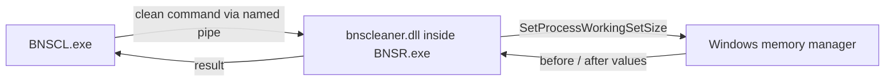

# BNSCL

[Русская версия](README-RU.md)

BNSCL is a compact working-set cleaner for **Blade & Soul NEO** on Windows. It consists of a small WPF controller and a native plugin loaded into `BNSR.exe`.

## Features

- one-click working-set cleanup;
- configurable global hotkey;
- displays memory usage before and after cleanup;
- installs the required `winmm.dll` loader and `plugins\bnscleaner.dll`;
- backs up files before replacing them;
- no accounts, license checks, telemetry, or network requests.

## How it works



The native plugin calls `SetProcessWorkingSetSize(GetCurrentProcess(), -1, -1)`. Windows removes unused pages from the game's working set and keeps them available for reuse. This does **not** modify game data, scan game memory, or permanently reduce committed/private memory. BNSR may gradually fill its working set again during normal use.

## Installation and use

1. Install the [.NET 8 Desktop Runtime](https://dotnet.microsoft.com/download/dotnet/8.0) if it is not already installed.
2. Download `BNSCL.exe` from the [latest release](https://github.com/Univashka/BNSCL/releases/latest).
3. Close Blade & Soul NEO.
4. Run `BNSCL.exe` as administrator and click **Install plugin**.
5. Start the game.
6. Use **Clean memory** or the configured global hotkey.

The application installs:

```text
BNSR\Binaries\Win64\winmm.dll
BNSR\Binaries\Win64\plugins\bnscleaner.dll
```

Existing files are copied to timestamped `.backup-*` files before replacement.

## Building from source

Requirements:

- Windows 10/11 x64;
- .NET 8 SDK;
- Visual Studio 2022 Build Tools with the Desktop development with C++ workload;
- Windows 10/11 SDK.

Build both the native plugin and the single-file controller:

```powershell
./build.ps1
```

The output is written to `release\BNSCL.exe`. The app is framework-dependent and does not bundle the .NET runtime.

## Project layout

```text
MemoryCleanerApp/   WPF controller, hotkey and installer
NativePlugin/       minimal native BNSR plugin
build.ps1           reproducible release build
```

## Disclaimer

This is an independent community project and is not affiliated with or endorsed by NCSOFT. Use third-party plugins at your own risk.
